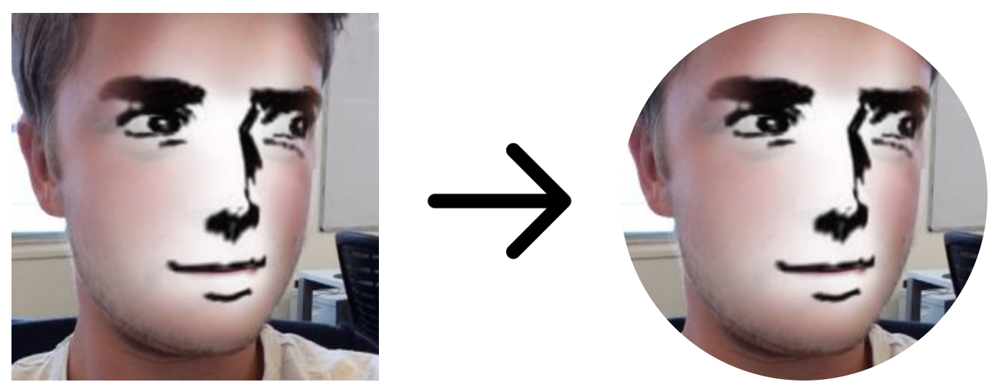

# Stylized Image URL Proxy

**Notice:** This repository was made for my own needs on [Mixer.com](https://mixer.com/Zeny-IC) to create rounded images by passing squared ones and use them in my description.

This repository is deployed on now.sh. At the moment only "round" format is supported but feel free to fork this project or create a pull request if you need something else.

# Usage

**Domain:** https://stylized-image-url-proxy.alexis-bize.now.sh
**Query parameters:**

-   url {string}: Source image URL
-   format {string}: Desired format

**Sample URL:**
https://stylized-image-url-proxy.alexis-bize.now.sh?url=https%3A%2F%2Fmixer.com%2Fapi%2Fv1%2Fusers%2F15302225%2Favatar&format=round

**Sample output:**

